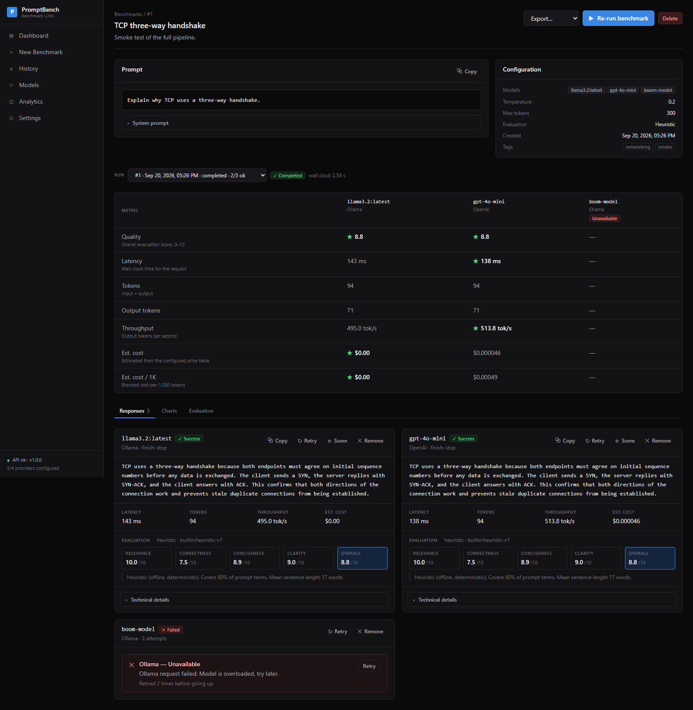
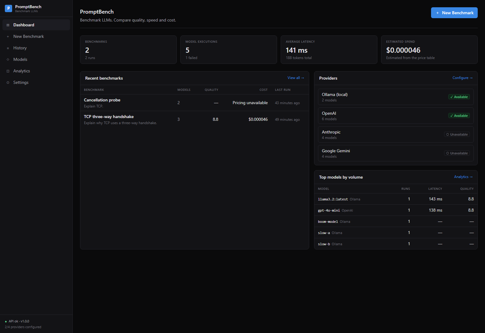
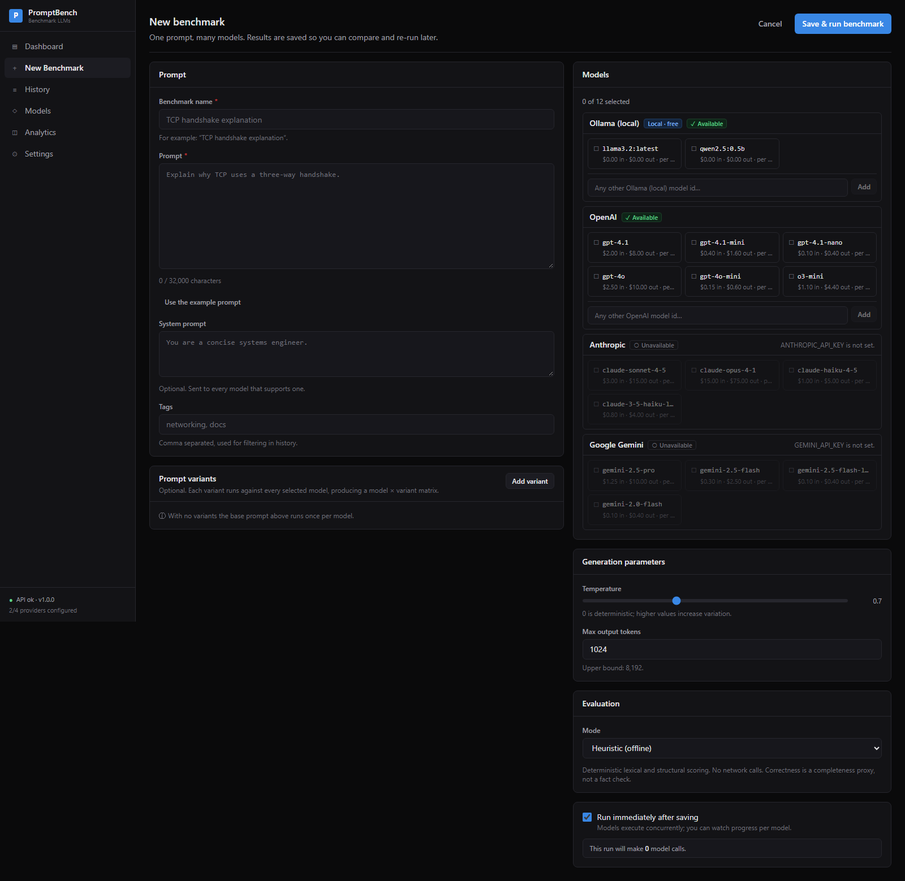
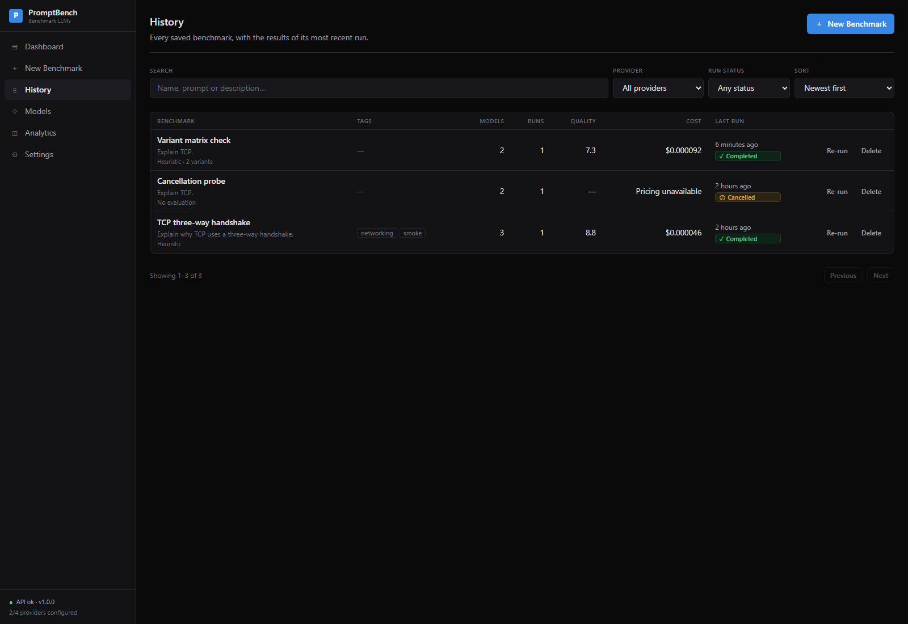
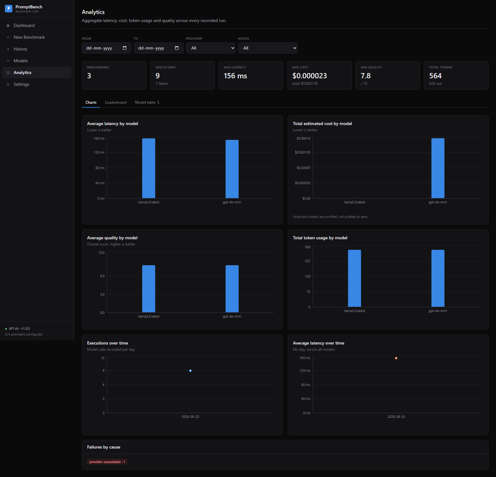
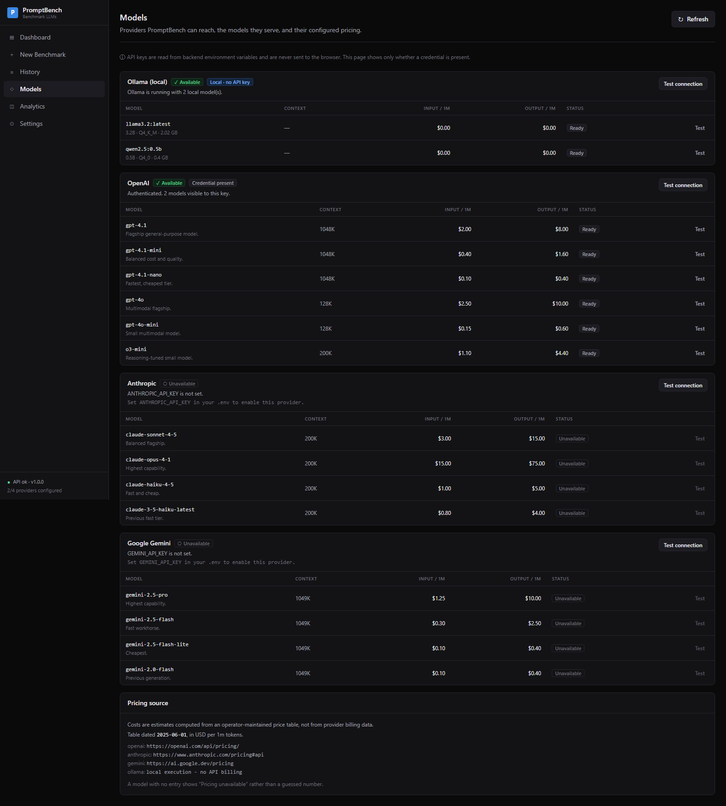
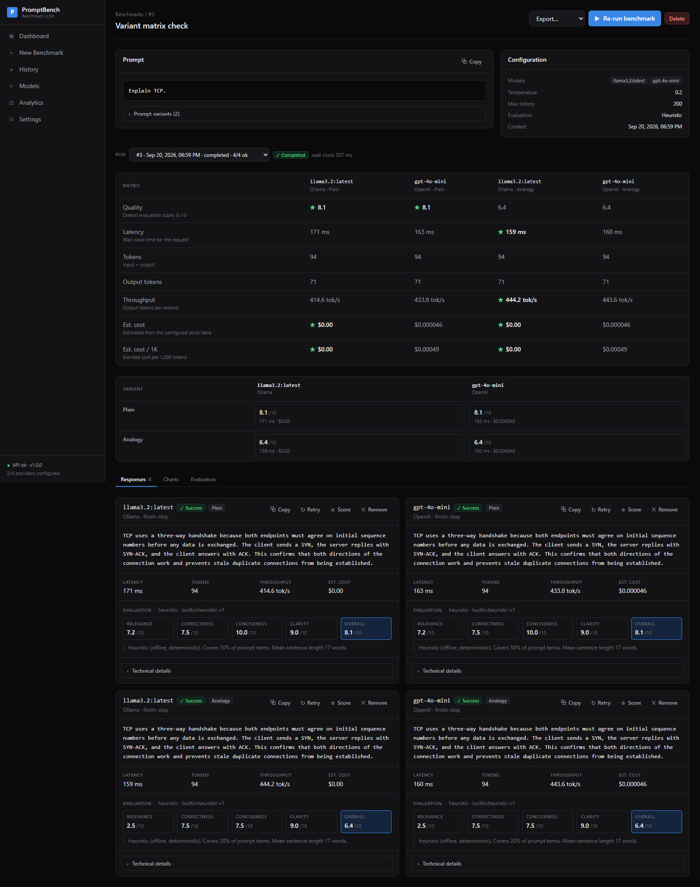

# PromptBench

**Benchmark LLMs. Compare quality, speed and cost.**

PromptBench is a local-first LLM prompt benchmarking platform. You write one
prompt, pick several models, and get a structured side-by-side comparison of
what each one actually produced — the response, latency, token usage, estimated
cost, throughput and evaluated quality — saved so you can re-run it later and
see what changed.

It is a developer and research tool, not a chatbot.

<p align="center">
  
</p>

---

## Contents

- [Why](#why)
- [Screenshots](#screenshots)
- [Features](#features)
- [Tech stack](#tech-stack)
- [Architecture](#architecture)
- [Installation](#installation)
- [Running locally](#running-locally)
- [Running with Docker](#running-with-docker)
- [Ollama setup](#ollama-setup)
- [Environment variables](#environment-variables)
- [Supported providers](#supported-providers)
- [API documentation](#api-documentation)
- [Database structure](#database-structure)
- [Evaluation methodology](#evaluation-methodology)
- [Pricing methodology](#pricing-methodology)
- [Testing](#testing)
- [Verification status](#verification-status)
- [Project structure](#project-structure)
- [Security](#security)
- [Future improvements](#future-improvements)
- [License](#license)

---

## Why

Choosing a model means trading quality against latency against cost, and that
trade-off is specific to your prompt. PromptBench makes the trade-off visible:
the same prompt, the same parameters, every model, one table.

Three principles shape the whole product:

1. **It runs with no API keys.** Ollama needs no credential, so the entire
   product — benchmarking, evaluation, analytics, export — works offline and
   free. A provider without a key reports as unavailable; it never breaks the app.
2. **It never invents numbers.** A model with no configured price shows
   "Pricing unavailable", not `$0.00`. Costs are labelled ESTIMATED everywhere
   because they come from a price table, not from provider billing.
3. **It explains its own metrics.** There is no opaque composite "best model"
   score. You choose the metric to rank by, and the methodology is printed next
   to the ranking.

---

## Screenshots

| | |
|---|---|
| **Dashboard** <br>  | **New benchmark** <br>  |
| **History** <br>  | **Analytics** <br>  |
| **Models** <br>  | **Prompt variants — model × variant matrix** <br>  |

> These are real screenshots of the running application. The provider endpoints
> behind them were served by a local stand-in during capture, so the model
> names and figures are from that session, not from a vendor API.

---

## Features

### Benchmarking
- One prompt, many models, executed **concurrently** under a semaphore.
- Optional system prompt, temperature, max output tokens.
- **Prompt variants** — several phrasings of a prompt run against every model,
  producing a model × variant matrix.
- Live per-model progress over server-sent events, with a polling fallback.
- **Cancellation** that aborts in-flight provider requests, not just the queue.
- Per-provider timeouts and bounded exponential-backoff retries, applied only
  to failures worth retrying.

### Comparison
- Metric table: quality, latency, tokens, output tokens, throughput, estimated
  cost and blended cost per 1K tokens, with the best value in each row marked.
- Response cards with copy, expand, retry, remove-from-comparison and manual
  scoring.
- Expandable technical panel: provider, model, request id, finish reason, token
  source, generation parameters and the raw provider metadata.

### Evaluation
Four criteria — relevance, correctness, conciseness, clarity — each 0–10, plus
an overall score. Four modes: disabled, heuristic (offline), LLM-as-a-judge, and
manual. See [Evaluation methodology](#evaluation-methodology).

### Analysis
- Analytics dashboard with totals, per-model and per-provider breakdowns, a
  daily timeline and a failure-cause breakdown, filterable by date, provider,
  model and benchmark.
- Leaderboard ranked by an explicit metric you pick.
- History with search, filtering, sorting, pagination, re-run and delete.

### Export
JSON, CSV, Markdown and a self-contained HTML report — each carrying the prompt,
model, provider, response, latency, tokens, cost, evaluation scores and timestamps.

---

## Tech stack

| Layer | Choice |
|---|---|
| Frontend | Next.js 15 (App Router), React 19, TypeScript, Tailwind CSS v4, Recharts |
| Backend | Python 3.11+, FastAPI, Pydantic v2, SQLAlchemy 2.0 (async) |
| Database | SQLite by default; PostgreSQL by changing one environment variable |
| HTTP | `httpx` for every provider — no vendor SDKs |
| Tests | pytest + pytest-asyncio (backend), Vitest + Testing Library (frontend) |

---

## Architecture

```
          frontend (Next.js)
                 │  REST + SSE
                 ▼
          FastAPI  ── api/ ── schemas/ (Pydantic; ORM models are never returned)
                 │
                 ▼
          Benchmark engine ── concurrency · timeouts · retries · cancellation
                 │                        │
                 │                        └──► Evaluator interface
                 │                                 ├── HeuristicEvaluator (offline)
                 ▼                                 ├── LLMJudgeEvaluator
          Provider adapter interface               └── ManualEvaluator
   ┌─────────────┬─────────────┬─────────────┬─────────────┐
   │   OpenAI    │  Anthropic  │   Gemini    │   Ollama    │
   └─────────────┴─────────────┴─────────────┴─────────────┘
                 │
                 ▼
          SQLAlchemy ──► SQLite / PostgreSQL
```

Every adapter normalises its provider's response into one shape:

```json
{
  "provider": "...", "model": "...", "response": "...",
  "input_tokens": 0, "output_tokens": 0, "total_tokens": 0,
  "latency_ms": 0, "tokens_per_second": 0.0,
  "estimated_cost": 0.0, "finish_reason": "stop",
  "token_source": "provider", "metadata": {}
}
```

Nothing above the adapter layer knows which provider produced a result. Adding a
provider means writing one `LLMProvider` subclass and adding it to the registry;
the engine does not change. See [ARCHITECTURE.md](ARCHITECTURE.md) for the
reasoning behind each decision.

---

## Installation

**Prerequisites:** Python 3.11+, Node.js 20+. Optionally [Ollama](https://ollama.com)
for free local models, and Docker if you prefer containers.

```bash
git clone <your-fork-url> promptbench
cd promptbench
cp .env.example .env     # every value is optional; the app starts with none set
```

---

## Running locally

**Backend** (terminal 1):

```bash
cd backend
python -m venv .venv
source .venv/bin/activate          # Windows: .venv\Scripts\activate
pip install -r requirements-dev.txt
uvicorn app.main:app --reload --port 8000
```

The API is at <http://localhost:8000>, interactive docs at
<http://localhost:8000/docs>. The SQLite schema is created on first start.

**Frontend** (terminal 2):

```bash
cd frontend
npm install
npm run dev
```

Open <http://localhost:3000>.

---

## Running with Docker

```bash
docker compose up --build
```

- Frontend: <http://localhost:3000>
- Backend: <http://localhost:8000>

Benchmark history is stored in the `promptbench-data` volume and survives
rebuilds. The backend container reaches an Ollama daemon running on your **host**
via `host.docker.internal`, so local models keep working from inside Docker.

Override ports or credentials through the environment:

```bash
BACKEND_PORT=8010 FRONTEND_PORT=3010 \
NEXT_PUBLIC_API_URL=http://localhost:8010 \
OPENAI_API_KEY=sk-... docker compose up --build
```

> `NEXT_PUBLIC_API_URL` is inlined into the browser bundle **at build time**, so
> it must be the URL your browser uses — not the internal service name. Change
> it and you must rebuild the frontend image.

---

## Ollama setup

Ollama is what makes PromptBench free to use. It requires no API key.

```bash
# 1. Install from https://ollama.com, then:
ollama serve

# 2. Pull a model (3B fits comfortably on a laptop)
ollama pull llama3.2

# 3. Confirm PromptBench can see it
curl http://localhost:11434/api/tags
```

The Models page detects Ollama automatically and lists whatever you have pulled.
If the daemon is down, Ollama reports as unavailable with the command to fix it
and the rest of the app carries on.

Point `OLLAMA_BASE_URL` at a remote daemon if it does not run on localhost.

**Tip:** set `JUDGE_PROVIDER=ollama` and `JUDGE_MODEL=llama3.2` to run
LLM-as-a-judge evaluation locally, so even judged benchmarks cost nothing.

---

## Environment variables

All configuration lives in `.env` at the repository root. Nothing is required.

| Variable | Default | Purpose |
|---|---|---|
| `ENVIRONMENT` | `development` | `production` hides internal error detail from responses. |
| `DEBUG` | `false` | Verbose logging. |
| `DATABASE_URL` | `sqlite+aiosqlite:///./promptbench.db` | Swap for `postgresql+asyncpg://…` to use Postgres. |
| `CORS_ORIGINS` | `http://localhost:3000` | Comma-separated allowed origins. |
| `OPENAI_API_KEY` | — | Enables OpenAI. |
| `ANTHROPIC_API_KEY` | — | Enables Anthropic. |
| `GEMINI_API_KEY` | — | Enables Google Gemini. |
| `OPENAI_BASE_URL` / `ANTHROPIC_BASE_URL` / `GEMINI_BASE_URL` | vendor defaults | For gateways and proxies. |
| `OLLAMA_BASE_URL` | `http://localhost:11434` | Local model daemon. |
| `REQUEST_TIMEOUT_SECONDS` | `120` | Per-provider request timeout. |
| `CONNECT_TIMEOUT_SECONDS` | `10` | Connection timeout. |
| `MAX_RETRIES` | `2` | Retries **after** the first attempt, for retryable failures only. |
| `RETRY_BASE_DELAY_SECONDS` | `0.5` | Exponential-backoff base. |
| `MAX_CONCURRENCY` | `8` | Simultaneous in-flight model calls. |
| `MAX_PROMPT_CHARS` | `32000` | Prompt size limit. |
| `MAX_SYSTEM_PROMPT_CHARS` | `8000` | System prompt size limit. |
| `MAX_OUTPUT_TOKENS_LIMIT` | `8192` | Ceiling on `max_tokens`. |
| `MAX_MODELS_PER_BENCHMARK` | `12` | Selection limit. |
| `MAX_VARIANTS_PER_BENCHMARK` | `10` | Variant limit. |
| `EVALUATION_DEFAULT_MODE` | `heuristic` | `disabled` / `heuristic` / `llm_judge` / `manual`. |
| `JUDGE_PROVIDER`, `JUDGE_MODEL` | — | Default judge for LLM-as-a-judge mode. |
| `PRICING_FILE` | bundled table | Path to your own pricing JSON. |
| `NEXT_PUBLIC_API_URL` | `http://localhost:8000` | Browser-visible API URL. **Never put a secret here.** |

API keys are read by the backend process only. They are never written to the
database, never returned by any endpoint, and redacted from logs.

---

## Supported providers

| Provider | Credential | Status without it | Cost |
|---|---|---|---|
| **Ollama** (local) | none | Unavailable if the daemon is down | Free — runs on your machine |
| **OpenAI** | `OPENAI_API_KEY` | Listed as unavailable | Estimated from the price table |
| **Anthropic** | `ANTHROPIC_API_KEY` | Listed as unavailable | Estimated from the price table |
| **Google Gemini** | `GEMINI_API_KEY` | Listed as unavailable | Estimated from the price table |

The hosted providers ship a short curated model list, but the adapters do not
validate against it — type any model id your account can reach and it will run.

Adding a provider: see [CONTRIBUTING.md](CONTRIBUTING.md#adding-a-provider).

---

## API documentation

Full reference in [API.md](API.md); an interactive OpenAPI UI is served at
`/docs` while the backend runs.

| Method | Path | Purpose |
|---|---|---|
| `GET` | `/api/health` | Liveness, database and provider configuration. |
| `GET` | `/api/models` | Providers, models, availability and pricing. |
| `POST` | `/api/models/test` | Test a provider, optionally probing one model. |
| `POST` | `/api/benchmarks` | Create a benchmark. |
| `GET` | `/api/benchmarks` | Search / filter / sort / paginate history. |
| `GET` | `/api/benchmarks/{id}` | One benchmark with its runs. |
| `PATCH` | `/api/benchmarks/{id}` | Update name, description, tags. |
| `DELETE` | `/api/benchmarks/{id}` | Delete a benchmark and its runs. |
| `POST` | `/api/benchmarks/{id}/run` | Start a run (optional per-run overrides). |
| `POST` | `/api/benchmarks/{id}/rerun` | Re-run with the saved configuration. |
| `GET` | `/api/runs/{id}` | A run with all of its results. |
| `GET` | `/api/runs/{id}/progress` | Poll live progress. |
| `GET` | `/api/runs/{id}/stream` | Server-sent progress events. |
| `POST` | `/api/runs/{id}/cancel` | Cancel an in-flight run. |
| `GET` | `/api/runs/{id}/matrix` | Model × variant matrix. |
| `DELETE` | `/api/results/{id}` | Remove one result from a comparison. |
| `POST` | `/api/evaluate` | Score one result or a whole run. |
| `GET` | `/api/analytics` | Aggregate metrics with filters. |
| `GET` | `/api/leaderboard` | Rank models by an explicit metric. |
| `GET` | `/api/export/{id}?format=…` | `json` \| `csv` \| `markdown` \| `html`. |
| `GET` | `/api/settings` | Effective configuration — never secrets. |

Errors use one envelope, so the UI can always say something useful:

```json
{
  "error": {
    "code": "authentication",
    "message": "Gemini request failed: API key is missing.",
    "hint": "Check that the provider's API key environment variable is set and valid.",
    "provider": "gemini",
    "retryable": false
  }
}
```

---

## Database structure

```
benchmarks ──1:N──► prompt_variants
     │
     └───1:N──► benchmark_runs ──1:N──► model_results ──1:1──► evaluations
```

| Table | Holds |
|---|---|
| `benchmarks` | Name, prompt, system prompt, temperature, max tokens, evaluation config, selected models, tags. |
| `prompt_variants` | Alternative phrasings under a benchmark. |
| `benchmark_runs` | One execution: status, start/finish, and a **snapshot** of the parameters used. |
| `model_results` | One (model × variant) outcome: response, tokens, latency, throughput, cost, finish reason, error code/message, attempts, raw metadata. |
| `evaluations` | Relevance, correctness, conciseness, clarity, overall, reasoning, mode, evaluator. |

Foreign keys cascade on delete. Runs store a parameter snapshot so history stays
truthful even after a benchmark's metadata is edited.

---

## Evaluation methodology

Four criteria, each scored 0–10: **relevance, correctness, conciseness, clarity**,
plus an **overall** score (supplied by the evaluator, or a weighted mean —
relevance 0.30, correctness 0.30, clarity 0.25, conciseness 0.15 — when it is not).

| Mode | Needs credentials | What it does |
|---|---|---|
| **Disabled** | no | Skips scoring; still measures latency, tokens and cost. |
| **Heuristic** | no | Deterministic, offline, the default. |
| **LLM judge** | a provider (a local Ollama model counts) | A second model scores each response and returns JSON. |
| **Manual** | no | You score each response yourself in the UI. |

**What heuristic mode actually measures** — stated plainly, because an
evaluation metric that overstates itself is worse than none:

- *relevance* — lexical coverage of the prompt's content words, plus a bonus for
  explanatory connectives on explanation-style prompts. A genuine signal.
- *correctness* — **a proxy, not a fact check.** It scores whether the response
  looks like a delivered answer: non-empty, not a refusal, not truncated
  mid-sentence, not hedged into uselessness. Use LLM-judge or manual mode when
  factual accuracy is what you care about.
- *conciseness* — length against a prompt-scaled target band, penalised for
  repeated sentences and filler openers.
- *clarity* — sentence-length distribution and the presence of structure.

Identical input always yields an identical score, which makes heuristic mode
useful for regression comparison across runs.

**LLM judge** runs at temperature 0 and must return one JSON object. Its output
is parsed defensively (code fences, surrounding prose and nested objects are all
handled) and validated with Pydantic. A malformed verdict never breaks a
benchmark: the generation is kept and the failure is recorded on the result.

Scores are only comparable between results scored in the **same mode**. The UI
records the mode and evaluator model on every evaluation and says so.

---

## Pricing methodology

Cost is computed in exactly one place, from one table
(`backend/app/core/pricing.json`):

```
estimated_cost = input_tokens  / 1_000_000 × input_price
               + output_tokens / 1_000_000 × output_price
```

- Every cost in the product is labelled **ESTIMATED**. It comes from an
  operator-maintained price table, not from provider billing.
- The table carries an `as_of` date and the vendor pricing pages it was taken
  from. **Verify it before relying on it.**
- A model absent from the table returns `null`, which renders as **"Pricing
  unavailable"** — never `$0.00`. Unpriced executions are excluded from cost
  aggregates rather than counted as free, and the UI says how many were excluded.
- Ollama is priced at `0` because local execution genuinely incurs no API charge.
- Override with `PRICING_FILE=/path/to/pricing.json`, then hit
  `POST /api/settings/pricing/reload` — no restart needed.

Alongside per-request cost, PromptBench reports **blended cost per 1,000 tokens**,
which is what makes models with different verbosity comparable.

---

## Testing

```bash
# Backend — 202 tests
cd backend
pytest -q
pytest --cov=app --cov-report=term-missing   # with coverage
ruff check . && ruff format --check .
mypy app

# Frontend — 70 tests
cd frontend
npm test
npm run lint
npm run typecheck
npm run build
```

Backend coverage includes all four provider adapters (driven through a mock HTTP
transport, so real request construction and parsing are exercised), cost
calculation, token accounting, evaluator parsing of malformed output, database
operations, every endpoint, error classification, concurrency, failure isolation,
retry bounds and cancellation.

Frontend coverage includes formatters, the API client's error handling, the
model picker, comparison table, response cards, progress panel, variant matrix
and the history, results and models pages including their loading, empty and
error states.

Every check above also runs in CI on each push and pull request
([`.github/workflows/ci.yml`](.github/workflows/ci.yml)), which additionally
builds both Docker images.

---

## Verification status

Being precise about this matters more than looking finished, so each claim below
says how it was actually checked.

| Area | Status | How it was verified |
|---|---|---|
| Backend API, engine, evaluation, analytics, export | **Verified** | 202 automated tests, plus end-to-end runs against a local HTTP server |
| Frontend pages, components, formatting | **Verified** | 70 automated tests; pages also opened in a browser |
| Concurrency, retries, failure isolation, cancellation | **Verified** | Exercised end-to-end, including timing assertions |
| Cost and token arithmetic | **Verified** | Unit tests including sub-cent and sub-millisecond cases |
| Docker build and startup | **Verified** | `docker compose up --build` reached healthy and ran a benchmark with no API keys set |
| Provider adapters (OpenAI, Anthropic, Gemini, Ollama) | **Tested against compatible local HTTP endpoints** | Request construction, response parsing, token extraction, error classification and retry behaviour are exercised over real HTTP against servers speaking each vendor's wire protocol — **not** against the vendors themselves |
| Live OpenAI / Anthropic / Gemini calls | **Not verified — credentials unavailable** | No API keys were present in the development environment |
| Live Ollama calls | **Not verified — Ollama unavailable** | No Ollama daemon was installed or reachable on `:11434` |

What this means in practice: the adapters are exercised against the documented
shape of each API, so a protocol-level mistake would be caught, but a
discrepancy between a vendor's documentation and its live behaviour would not
be. If you run PromptBench against a real provider and something does not
normalise correctly, that is the most likely place for it, and a bug report with
the raw response is the fastest way to get it fixed.

---

## Project structure

```
promptbench/
├── backend/
│   ├── app/
│   │   ├── api/routes/      # HTTP endpoints
│   │   ├── core/            # config, errors, logging, pricing
│   │   ├── db/              # engine, session, declarative base
│   │   ├── models/          # SQLAlchemy ORM
│   │   ├── schemas/         # Pydantic request/response contracts
│   │   ├── providers/       # LLMProvider interface + 4 adapters
│   │   ├── evaluation/      # Evaluator interface + 3 evaluators
│   │   ├── services/        # engine, analytics, export, run tracker
│   │   └── main.py
│   ├── tests/
│   ├── Dockerfile
│   └── pyproject.toml
├── frontend/
│   ├── app/                 # App Router pages
│   ├── components/          # ui/, layout/, benchmark/, charts/
│   ├── hooks/               # useAsync, useAction, useRunProgress
│   ├── lib/                 # api client, formatters, chart theme
│   ├── types/               # backend schema mirror
│   ├── test/
│   └── Dockerfile
├── docs/screenshots/
├── docker-compose.yml
├── .env.example
├── ARCHITECTURE.md
├── API.md
├── CONTRIBUTING.md
└── LICENSE
```

---

## Security

- API keys live in backend environment variables. They are never stored in the
  database, never returned by any endpoint, and a logging filter redacts
  anything resembling a credential.
- The Gemini key is sent as a header, not a query parameter, so it cannot leak
  into a URL or proxy log.
- All input is validated by Pydantic: prompt size, system prompt size, max
  output tokens, model count, variant count, tag count, temperature range.
- Provider base URLs come from the environment, never from user input, so the
  API cannot be used to fetch arbitrary URLs.
- Export filenames are sanitised against path traversal and header injection.
- In production, unhandled errors return an opaque message plus an incident id;
  the stack trace stays in the server log.
- CORS origins are configured through the environment.

PromptBench ships **no authentication** — it is designed to run on your own
machine. Put it behind an authenticating proxy before exposing it to a network.

---

## Future improvements

- Streaming token-by-token responses in the comparison view.
- Benchmark templates and shareable read-only result URLs.
- User-defined evaluation criteria beyond the built-in four.
- CSV dataset benchmarking (one prompt per row) and batch runs.
- Regression detection between runs of the same benchmark, and a CI mode that
  fails a build when quality drops.
- Alembic migrations (the schema is currently created from metadata at startup).
- Authentication, for multi-user deployments.

---

## License

MIT — see [LICENSE](LICENSE).
